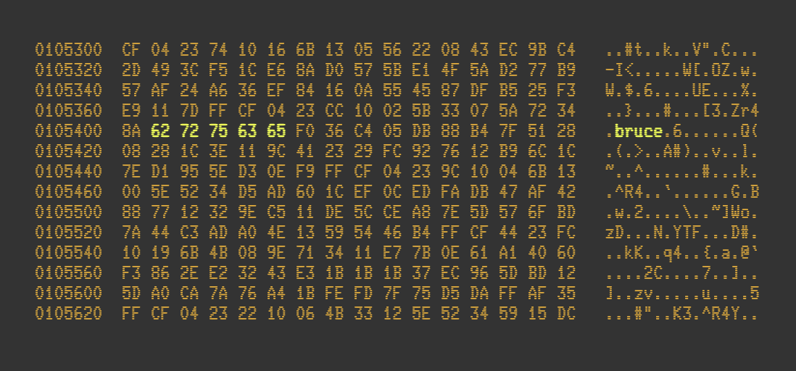

= Bruce
:doctype: article
:!showtitle:
:icons: font
:toc: preamble
:toclevels: 4



image:https://sonarcloud.io/api/project_badges/measure?project=mcaserta_bruce&metric=alert_status["Quality Gate Status", link="https://sonarcloud.io/dashboard?id=mcaserta_bruce"]
image:https://sonarcloud.io/api/project_badges/measure?project=mcaserta_bruce&metric=security_rating["Security Rating", link="https://sonarcloud.io/dashboard?id=mcaserta_bruce"]
image:https://sonarcloud.io/api/project_badges/measure?project=mcaserta_bruce&metric=vulnerabilities["Vulnerabilities", link="https://sonarcloud.io/dashboard?id=mcaserta_bruce"]


Bruce is an opinionated, ergonomic, lightweight, pure Java wrapper around the Java Cryptography API.


== Features

* All functionality is exposed through the `Bruce` entry point class. Just type `Bruce.` and let your IDE's autocomplete
do the rest.
* No checked exceptions cluttering your code.
* No transitive dependencies. Zero. Zilch.
* Support for different encodings:
link:https://en.wikipedia.org/wiki/Base64[Base64],
link:https://en.wikipedia.org/wiki/Percent-encoding[Url],
link:https://en.wikipedia.org/wiki/MIME[Mime],
link:https://en.wikipedia.org/wiki/Hexadecimal[Hex].
* Out of the box support for:
- key stores
- public, private and secret keys
- certificates
- digital signatures
- symmetric and asymmetric encryption
- message digesters
- message authentication codes
- custom providers such as link:https://www.bouncycastle.org/java.html[Bouncy Castle]
* Massively unit tested.
* Open Source: you don't need to trust Bruce: you can see for yourself if you like what Bruce does.

== Requirements

* Java 15

== How to Bruce

=== Setup

==== With Apache Maven

```xml

<dependency>
    TODO
</dependency>
```

==== With Gradle

TODO

==== Old School

Download the latest jar release from link:TODO[here].

=== Keystore

TODO

=== Keys

TODO

=== Certificate

TODO

=== Signature

==== With a Single Key

TODO

==== With Multiple Keys

TODO

=== Symmetric Encription

TODO

=== Asymmetric Encryption

TODO

=== Message Digests

TODO

=== Message Authentication Codes

TODO

== License

Bruce is licensed under the Apache License, Version 2.0.
