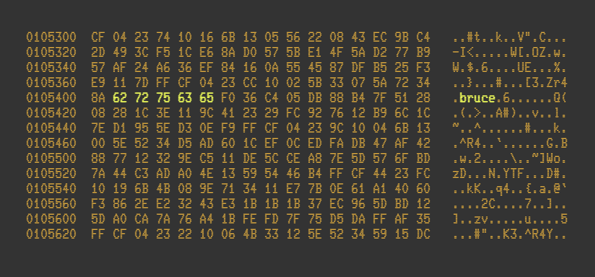

= Bruce
:doctype: article
:!showtitle:
:icons: font
:toc: preamble
:toclevels: 4

image:https://sonarcloud.io/api/project_badges/measure?project=mcaserta_bruce&metric=alert_status["Quality Gate Status",link="https://sonarcloud.io/dashboard?id=mcaserta_bruce"]
image:https://sonarcloud.io/api/project_badges/measure?project=mcaserta_bruce&metric=security_rating["Security Rating",link="https://sonarcloud.io/dashboard?id=mcaserta_bruce"]
image:https://sonarcloud.io/api/project_badges/measure?project=mcaserta_bruce&metric=vulnerabilities["Vulnerabilities",link="https://sonarcloud.io/dashboard?id=mcaserta_bruce"]
image:https://img.shields.io/maven-central/v/com.mirkocaserta.bruce/bruce["Maven Central",link="https://central.sonatype.com/artifact/com.mirkocaserta.bruce/bruce"]

Bruce is an ergonomic, lightweight, pure Java wrapper around the Java Cryptography API.

- link:https://central.sonatype.com/artifact/com.mirkocaserta.bruce/bruce[Download from Maven Central]
- link:https://bruce.mirkocaserta.com[Online documentation]
